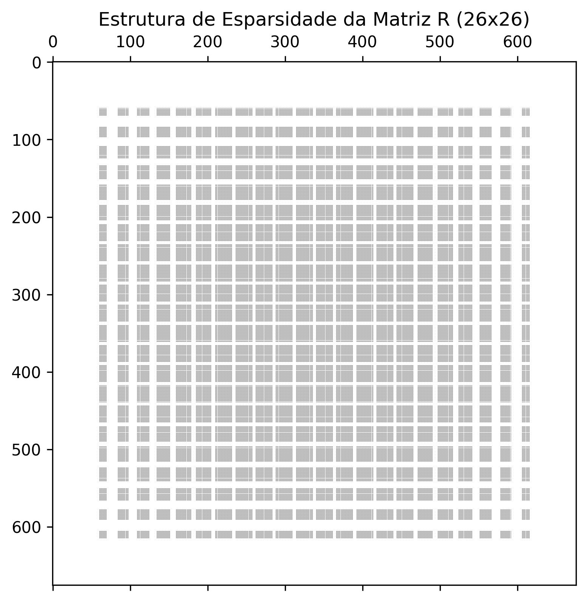

# Tópico 1: Condensação e Matriz R

Data de Execução: 2026-06-08 15:07:43

## Dedução Analítica da Equação (5.3)

O sistema acoplado completo divide-se em blocos mecânicos e hidráulicos. A conservação de massa da rede hidráulica é governada pelo sistema linear:
$$\mathbb{A}\mathbf{p} = -h^2 \mathbb{U}\mathbf{v} + \mathbf{\tilde{b}}$$

Isolando o vetor de pressões nodais $\mathbf{p}$:
$$\mathbf{p} = \mathbb{A}^{-1}(-h^2 \mathbb{U}\mathbf{v} + \mathbf{\tilde{b}})$$

A equação de equilíbrio dinâmico da membrana projeta a força gerada pela pressão interna sobre a superfície através da matriz de acoplamento transposta $\mathbb{U}^T$:
$$\mathbb{M}\frac{d\mathbf{v}}{dt} + \mathbb{D}\mathbf{v} + \mathbb{K}\mathbf{w} - \mathbb{U}^T\mathbf{p} = 0$$

Substituindo a expressão da pressão $\mathbf{p}$ na equação da membrana:
$$\mathbb{M}\frac{d\mathbf{v}}{dt} + \mathbb{D}\mathbf{v} + \mathbb{K}\mathbf{w} - \mathbb{U}^T \left[ \mathbb{A}^{-1}(-h^2 \mathbb{U}\mathbf{v} + \mathbf{\tilde{b}}) \right] = 0$$
$$\mathbb{M}\frac{d\mathbf{v}}{dt} + \left(\mathbb{D} + h^2 \mathbb{U}^T \mathbb{A}^{-1} \mathbb{U}\right)\mathbf{v} + \mathbb{K}\mathbf{w} = \mathbb{U}^T \mathbb{A}^{-1} \mathbf{\tilde{b}}$$

Definindo a matriz de amortecimento hidráulico equivalente como $\mathbb{R} = h^2 \mathbb{U}^T \mathbb{A}^{-1} \mathbb{U}$, obtem-se diretamente a Equação (5.3):
$$\mathbb{M}\frac{\mathbf{v}^{n+1}-\mathbf{v}^n}{\delta t} + (\beta \mathbb{M} + \mathbb{R})\mathbf{v}^{n+1} + \mathbb{K}\mathbf{w}^{n+1} = \mathbb{U}^T \mathbb{A}^{-1} \mathbf{\tilde{b}}^{n+1}$$

### Análise de Propriedade Estrutural
- **Dimensão da Matriz R calculada:** 676 x 676
- **Elementos não-nulos (nnz):** 173056
- **Estrutura:** Diferente do amortecimento intrínseco (diagonal), a matriz R apresenta uma estrutura densa/bloqueada localmente devido à interconexão global que o escoamento hidráulico impõe sobre os nós livres do reservatório.

## Visualizações Associadas

