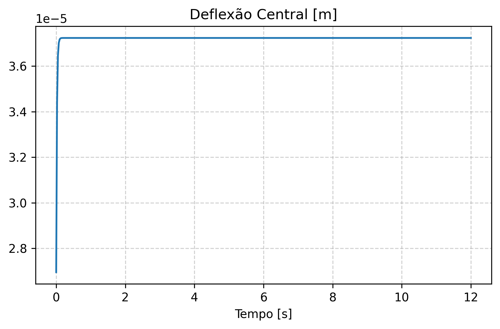
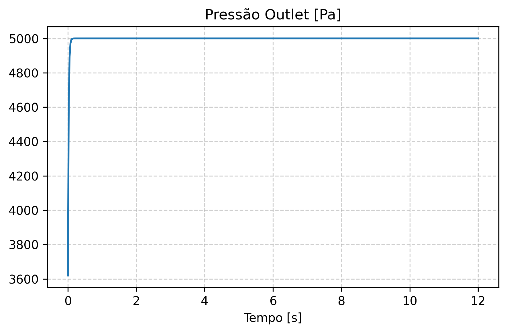
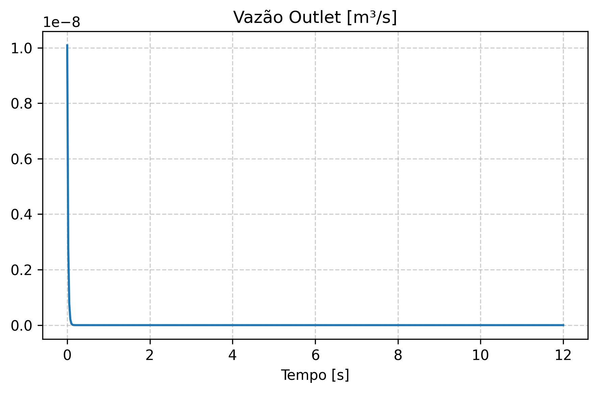
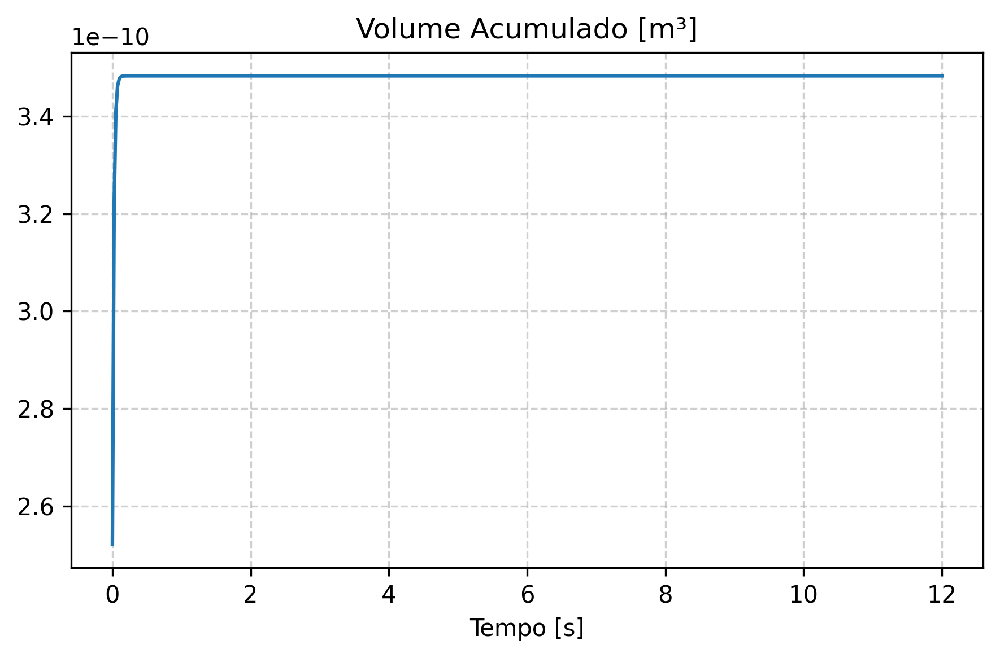
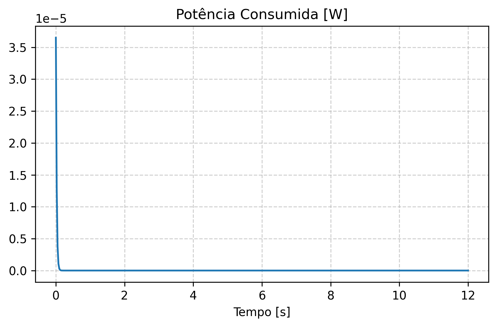

# Tópico 2: Evolução Transiente

Data de Execução: 2026-06-08 15:07:46

## Parâmetros da Simulação Base
- **Passo de tempo (dt):** 0.025 s
- **Malha da Membrana:** 51x51
- **Pressão Inlet:** 5000.0 Pa

## Resultados Temporais (Amostragem)

| Tempo [s] | Deflexão Central [m] | Pressão Outlet [Pa] | Vazão [m³/s] | Volume [m³] |
|---|---|---|---|---|
| 0.0000 | 2.695319e-05 | 3619.77 | 1.008565e-08 | 2.521412e-10 |
| 1.0750 | 3.723200e-05 | 5000.00 | 1.254681e-24 | 3.482957e-10 |
| 2.1750 | 3.723200e-05 | 5000.00 | 1.254681e-24 | 3.482957e-10 |
| 3.2500 | 3.723200e-05 | 5000.00 | 1.254681e-24 | 3.482957e-10 |
| 4.3500 | 3.723200e-05 | 5000.00 | 1.254681e-24 | 3.482957e-10 |
| 5.4500 | 3.723200e-05 | 5000.00 | 1.254681e-24 | 3.482957e-10 |
| 6.5250 | 3.723200e-05 | 5000.00 | 1.254681e-24 | 3.482957e-10 |
| 7.6250 | 3.723200e-05 | 5000.00 | 1.254681e-24 | 3.482957e-10 |
| 8.7250 | 3.723200e-05 | 5000.00 | 1.254681e-24 | 3.482957e-10 |
| 9.8000 | 3.723200e-05 | 5000.00 | 1.254681e-24 | 3.482957e-10 |
| 10.9000 | 3.723200e-05 | 5000.00 | 1.254681e-24 | 3.482957e-10 |
| 12.0000 | 3.723200e-05 | 5000.00 | 1.254681e-24 | 3.482957e-10 |

> *Nota técnica: O código está arquitetado para permitir simulações paramétricas automatizadas iterando sobre as propriedades exigidas.*

## Visualizações Associadas

