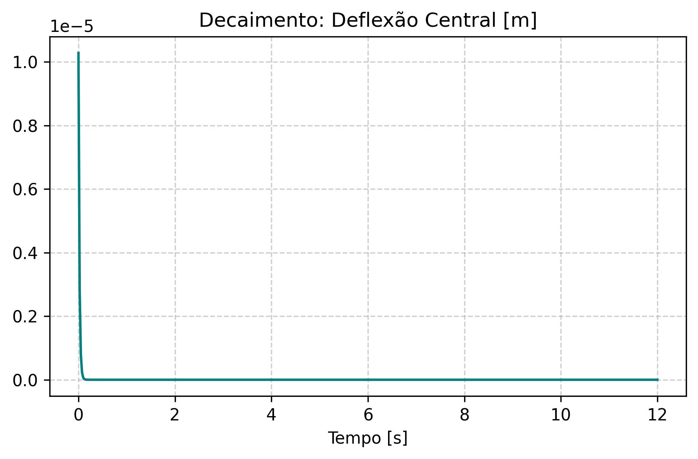
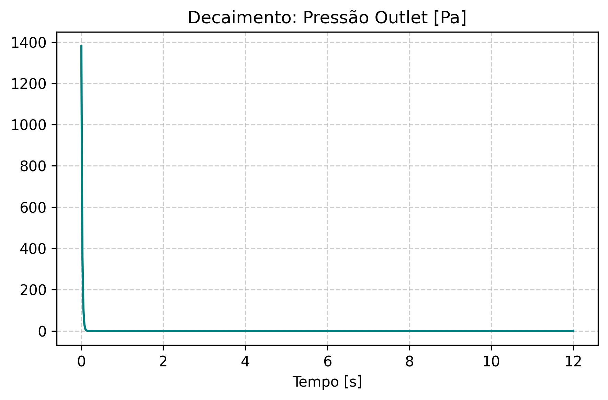
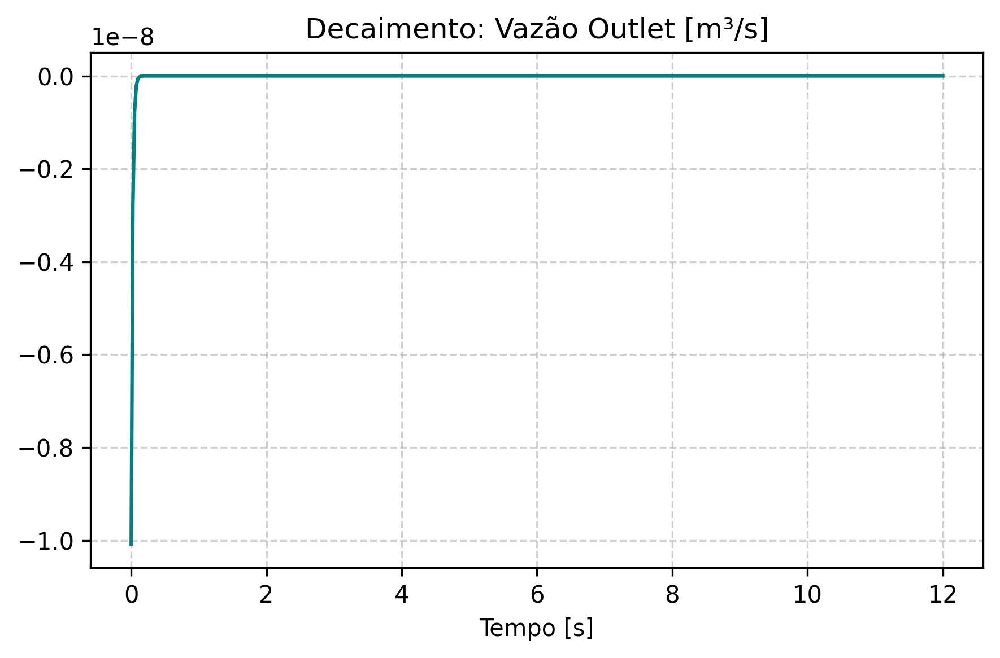
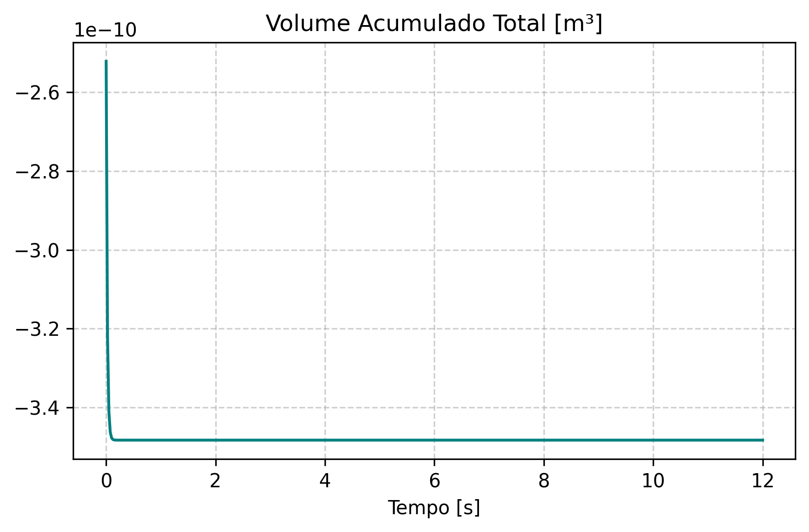
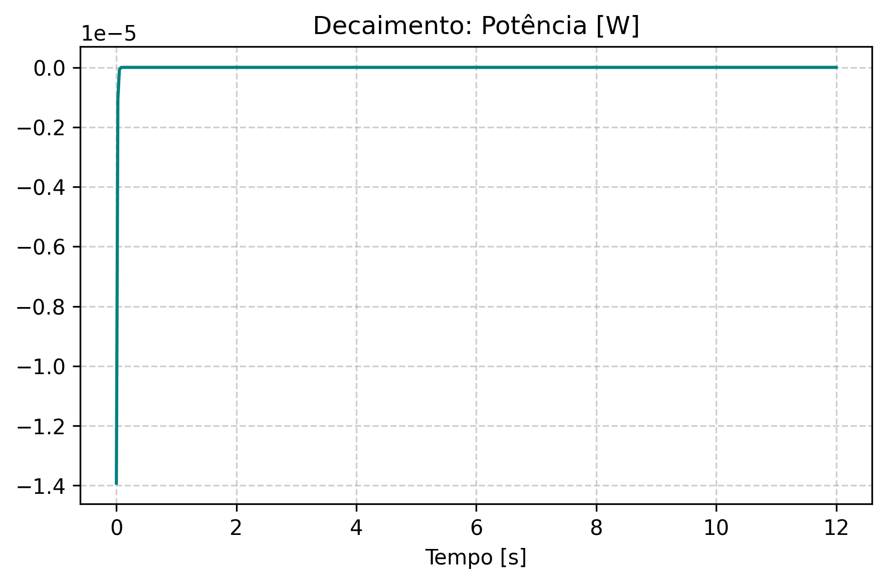

# Tópico 3: Estabilização após Queda Abrupta de Pressão

Data de Execução: 2026-06-08 15:07:48

## Parâmetros da Simulação de Relaxamento
- **Condição Inicial:** Estado dinâmico extraído da rotina base (p_inlet=5000 Pa).
- **Nova Pressão Inlet:** 0.0 Pa
- **Passo de tempo (dt):** 0.025 s
- **Malha da Membrana:** 51x51

## Resultados Temporais do Relaxamento (Amostragem)

| Tempo [s] | Deflexão Central [m] | Pressão Outlet [Pa] | Vazão [m³/s] | Volume [m³] |
|---|---|---|---|---|
| 0.0000 | 1.027881e-05 | 1380.23 | -1.008565e-08 | -2.521412e-10 |
| 1.0750 | 9.457530e-30 | 0.00 | -9.279873e-33 | -3.482957e-10 |
| 2.1750 | 2.402329e-54 | 0.00 | -2.357202e-57 | -3.482957e-10 |
| 3.2500 | 2.210384e-78 | 0.00 | -2.168863e-81 | -3.482957e-10 |
| 4.3500 | 5.614648e-103 | 0.00 | -5.509178e-106 | -3.482957e-10 |
| 5.4500 | 1.426190e-127 | 0.00 | -1.399399e-130 | -3.482957e-10 |
| 6.5250 | 1.312238e-151 | 0.00 | -1.287588e-154 | -3.482957e-10 |
| 7.6250 | 3.333246e-176 | 0.00 | -3.270631e-179 | -3.482957e-10 |
| 8.7250 | 8.466853e-201 | 0.00 | -8.307805e-204 | -3.482957e-10 |
| 9.8000 | 7.790357e-225 | 0.00 | -7.644017e-228 | -3.482957e-10 |
| 10.9000 | 1.978846e-249 | 0.00 | -1.941674e-252 | -3.482957e-10 |
| 12.0000 | 5.026513e-274 | 0.00 | -4.932091e-277 | -3.482957e-10 |

> *Nota técnica: Com a interrupção da força motriz, observa-se a dissipação de energia à medida que o sistema retorna elasticamente ao repouso.*

## Visualizações Associadas

