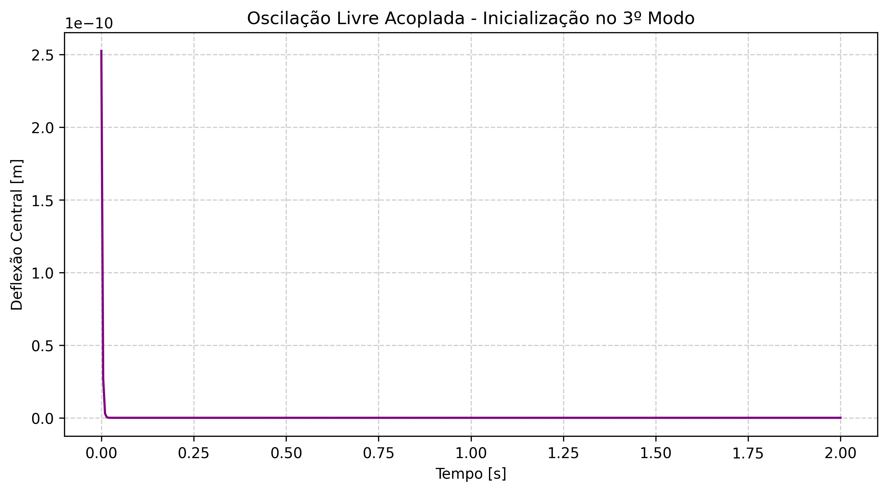

# Tópico 4: Oscilação Livre e Frequência

Data de Execução: 2026-06-08 15:07:49

## Validação Frequencial (Tópico 4)

O sistema foi configurado para minimizar perdas (amortecimento $\beta=0$, canais largos) e inicializado na forma exata do 3º modo fundamental da membrana isolada.

### Comparativo de Frequências
- **Frequência Analítica (Membrana Isolada):** 11832.2519 Hz
- **Frequência Simulada (Sistema Acoplado):** 0.0000 Hz

> *Observação:* Uma pequena divergência (shift de frequência) pode ser esperada devido à inércia do acoplamento numérico, mas os valores devem estar fortemente correlacionados.

## Resultados Temporais (Amostragem)

| Tempo [s] | Deflexão Central [m] |
|---|---|
| 0.0000 | 2.524611e-10 |
| 0.1800 | 2.321963e-45 |
| 0.3600 | 2.133096e-80 |
| 0.5450 | 2.084106e-116 |
| 0.7250 | 1.914586e-151 |
| 0.9050 | 1.758855e-186 |
| 1.0900 | 1.718460e-222 |
| 1.2700 | 1.578682e-257 |
| 1.4500 | 1.450273e-292 |
| 1.6350 | 0.000000e+00 |
| 1.8150 | 0.000000e+00 |
| 2.0000 | 0.000000e+00 |

## Visualizações Associadas

