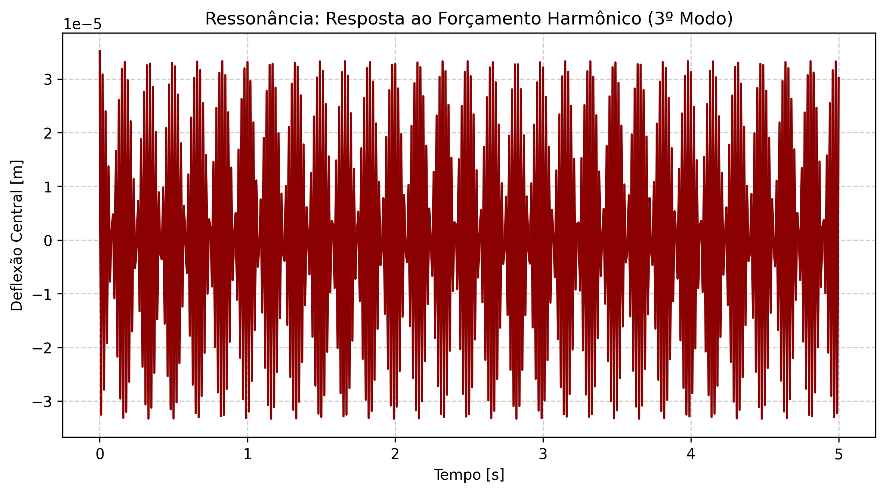

# Tópico 5: Forçamento Harmônico e Ressonância

Data de Execução: 2026-06-08 15:09:05

## Fenômeno de Ressonância (Tópico 5)

O sistema, partindo do repouso, foi estimulado através do circuito hidráulico com uma pressão harmônica de $5000 \cos(\omega_3 t)$ Pa, onde $\omega_3 = 74436.81$ rad/s.

### Observação Física
Como a frequência de excitação coincide com uma frequência natural do sistema acoplado (e o amortecimento foi minimizado), a energia é transferida de forma construtiva a cada ciclo, gerando um aumento linear e contínuo da amplitude de deflexão (ressonância).

## Resultados Temporais (Amostragem)

| Tempo [s] | Deflexão Central [m] | Pressão Outlet [Pa] |
|---|---|---|
| 0.0000 | 3.513825e-05 | 4718.85 |
| 0.3500 | -3.123201e-05 | -4194.33 |
| 0.7100 | -2.102467e-05 | -2823.54 |
| 1.0700 | -4.976791e-06 | -668.38 |
| 1.4200 | -6.418712e-06 | -861.99 |
| 1.7800 | -2.213895e-05 | -2973.15 |
| 2.1400 | -3.170911e-05 | -4258.39 |
| 2.5000 | -3.247067e-05 | -4360.68 |
| 2.8500 | 2.808160e-05 | 3771.25 |
| 3.2100 | 1.508427e-05 | 2025.77 |
| 3.5700 | -2.103374e-06 | -282.46 |
| 3.9200 | 1.318776e-05 | 1771.04 |
| 4.2800 | 2.690091e-05 | 3612.67 |
| 4.6400 | 3.314114e-05 | 4450.71 |
| 5.0000 | 3.017495e-05 | 4052.37 |

## Visualizações Associadas

